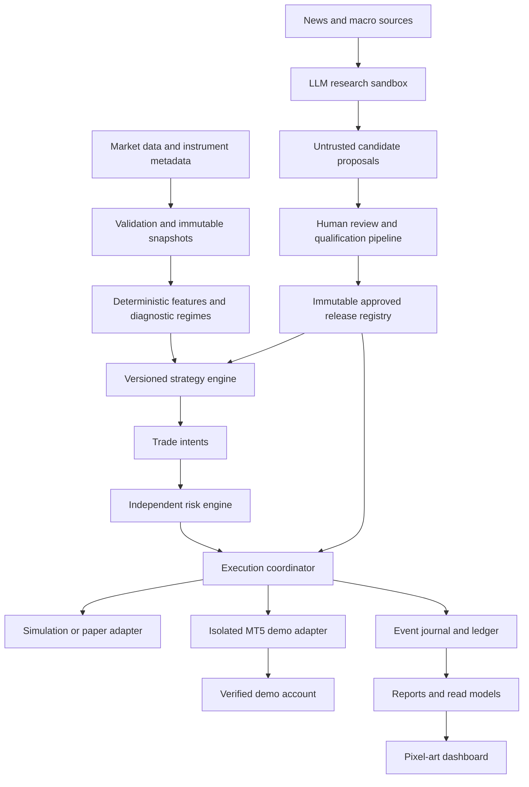

# Architecture

Status: proposed design; governed by [PRODUCT_SPEC.md](PRODUCT_SPEC.md).

## Components and trust boundaries

The research sandbox has no network route or service credentials to the execution gateway. Only the coordinator can call broker writes. The gateway independently checks demo account identity, runtime mode, release approval, and request identity. A strategy returns intentions, never broker requests. The UI cannot route around these boundaries.

| Component | Responsibility | Prohibited behavior |
|---|---|---|
| Ingestion/metadata | Validate OHLC, timestamps, availability, sessions, tick/lot units, costs | Silently repair or forward-fill tradable bars |
| Snapshot store | Immutable history, manifests, quality findings | Mutate a referenced dataset |
| Feature/regime engine | Pure feature calculation on information available at decision time | Fit using future observations |
| Strategy | Reproducible entry intent, fixed bracket policy, and state | Read network, wall clock, credentials, or account execution APIs |
| Risk engine | Size and approve/reject intents using fresh portfolio snapshots | Accept strategy-supplied final volume |
| Coordinator | Reserve risk, enforce approvals, order lifecycle and reconciliation | Blind retry of an ambiguous order submission |
| Adapter | Normalize broker/simulator instruments, fills and errors | Embed signal logic or weaken limits |
| Journal/ledger | Append events and maintain accounting projections | Rewrite historical fills to hide corrections |
| Reporting/UI | Read consistent snapshots and evidence | Infer success from submission acknowledgment |
| Candidate registry | Bind immutable artifacts to qualification and approval | Automatically promote LLM proposals |

## Shared deterministic domain

Strategy input: ordered completed bars, versioned feature state, instrument metadata, strategy position state, and injected UTC decision time. Output: zero or more typed intents plus new strategy state. Risk input additionally includes quotes, ledger equity, open positions, pending reservations, and the versioned policy. Neither function performs I/O. The shared deterministic post-fill bracket calculation uses actual-fill VWAP, the fixed stop, and target_rr=2; the coordinator applies it, independent risk validates it, and the adapter submits/acknowledges it. V0 is long-only across all three assets; sell requests may only reduce existing long exposure.

At a common bar close, process exits first, then entry intents in lexical canonical-asset order (`BTCUSD`, `USTEC100`, `XAUUSD`). Deduplicate bar signals by release, asset, bar close, and action; post-fill protection and asynchronous exits use episode, source event/fill IDs, action, and target version. Evaluate portfolio-wide entries serially against atomic reservations so simultaneous signals cannot overspend limits.

Market-data adapters, broker adapters, and injected clocks separate environments. Initial adapter contract: `capabilities`, `account_snapshot`, `instrument_metadata`, `quote`, `submit`, `amend_protection`, `cancel`, `order_status`, `positions`, `fills_since`, and `health`. Requests carry an idempotency key; results distinguish accepted, rejected, partially filled, filled, canceled, and unknown. Capability checks must verify demo account type and fixed SL/TP support, safe protection amendments, and paired exit quantity handling before enabling entries.

## Execution lifecycle and recovery

Intent → risk approved and budget reserved → durable submission request → submitted/unknown → acknowledged → partial/full fill or cancellation/rejection → reconciled. Broker observations may arrive out of order; use broker identifiers and event sequences to deduplicate. Persist before external writes. After a timeout or restart, query orders, positions, and fills before any resubmission. If the adapter cannot establish whether a request executed, mark it unknown and pause new entries for the account; manual resolution is required. Exactly-once broker delivery is not assumed.

Keep unused risk reserved for unfilled volume until confirmed terminal status. Ledger and reservation updates commit atomically. An entry must request the fixed SL immediately. A fill without confirmed SL triggers cancellation of remaining entry and an emergency close. Actual-fill TP necessarily follows execution: derive and submit it immediately through an append-only protection intent/risk decision/request chain, mark TP_PENDING, block further account entries, and require confirmation within 5 seconds of fill receipt. Rejection or deadline expiry triggers PROTECTION_FAILURE cancellation/close; record fill-to-confirmation latency separately from receipt latency. Before connection, D01 must validate this bounded post-fill workflow and broker stop/target constraints. Never predeclare a quote-derived TP as the final actual-fill target. Partial fills cancel residual entry and revise targets only as specified in [STRATEGY_V0.md](STRATEGY_V0.md). Paired SL/TP quantity tracks remaining exposure, and an exit cancels/reconciles its sibling so no reverse position can open. If closure is unavailable, retain critical status and retry only after reconciliation. Never declare flat until broker state confirms it.

On startup, reconcile the dedicated account before accepting strategy events. Unexpected external trades, mapping changes, missing events, or inconsistent balances pause entries. Adopt an external position only through an audited operator resolution; never treat it as a strategy-created fill.

## Runtime and operations

Modes are `RESEARCH`, `BACKTEST`, `PAPER_FORWARD`, `DEMO_QUALIFICATION`, and `DEMO_OPERATIONAL`. No live mode is implemented. Qualification modes require passed backtest evidence and explicit human authorization; demo qualification additionally requires passed paper forward evidence. Operational demo requires passed forward evidence and the operational readiness gate. All entry paths default to disabled and must explicitly verify mode and approval. Protective exits remain available while entries are paused. Revoked or expired release approval blocks entries but does not disable the coordinator's separately authorized risk-reducing close/cancel capability for existing exposure; demo identity, ownership, quantity, and audit checks still apply.

MT5 gateway is planned as a Windows-hosted process isolated from research workloads. One active coordinator owns a fenced account lease; losing ownership prevents further writes. Operational storage transactions protect the journal/outbox and reservations. Broker downtime cannot be solved by database locks, so recovery always reconciles external state.

Store secrets outside the repository in an approved OS/environment secret facility; redact logs and exception payloads. Configure authentication, least privilege, encrypted transport, dependencies, and secret scanning before demo deployment. Retention defaults: seven years for audit/approvals/ledger, one year for operational logs, and immutable referenced datasets for the lifetime of associated evidence, subject to D02 licensing and D05 owner approval.

Metrics include ingestion lag, last broker contact, unknown requests, unprotected positions, reconciliation differences, queue lag, risk rejections, and projection freshness. Targets: healthy local UI projection p95 lag ≤5 seconds; broker health polling every 5 seconds during execution; enter stale status after 15 seconds without a successful broker snapshot. Test deployments must record hardware and workload.

Reporting read models include the first-class Trading Calendar, with UTC risk days and separately labeled Bangkok display days, and authoritative text/icon states for the decorative animation mapping in [DASHBOARD_SPEC.md](DASHBOARD_SPEC.md). Calendar and animation projections have no execution authority.

## Controlled adaptation

Human-reviewed proposals become immutable candidate releases. Qualification references exact code, parameters, features, metadata, data manifests, risk policy, simulator, and environment hashes. Any changed dependency affecting behavior creates a new candidate. Runtime never hot-edits an approved strategy. Rollback selects a previously qualified compatible artifact, reconciles existing positions, and requires an audited operator action. A release switch waits until flat; risk-only protective handling continues during the transition.

All component test obligations are specified in [TEST_PLAN.md](TEST_PLAN.md). Framework versions, hosting, account topology, identity provider, and disaster recovery implementation remain decisions D01/D05.
